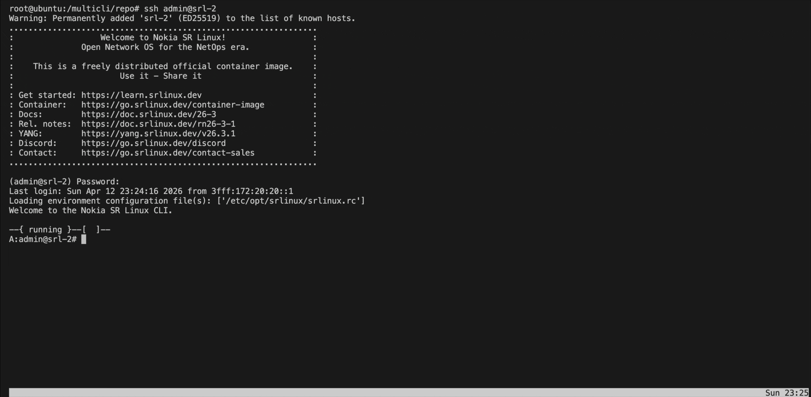

# MultiCLI Agent
Nokia SR Linux provides an NDK (NetOps Development Kit) that allows you to create Custom Applications/Agents. Thanks to this, through gRPC services, the custom application can receive notifications from SR Linux applications about information or events, such as interface status, routing table entries, LLDP sessions, BFD sessions, among others. This NDK also includes the capability to add entries to the router’s FIB. In the following link, you will find the NDK .proto files: https://github.com/nokia/srlinux-ndk-protobufs

In addition, this NOS supports the integration of a YANG data model for the custom application, providing full flexibility and operational access to the non-native agent through model-driven interfaces such as gRPC.
The MultiCLI Agent leverages these capabilities to streamline the deployment of custom CLI plugins developed within the MultiCLI project, eliminating the need to manually copy them onto the router.

The MultiCLI Agent is supported on Nokia SR Linux 25.3.1 and later, as it is built using the [NDK v0.5.0](https://learn.srlinux.dev/ndk/releases/0.5/).

# Installation
Clone the repository.
```
git clone https://github.com/srl-labs/MultiCLI.git
```
Transfer the .deb package to the SR Linux router. Make sure to match the correct architecture - ARM64 in this example.
```
scp MultiCLI/ndk-agent/srl-multicli_arm64.deb admin@srl-2:.
```
On the SR Linux router, enable the NDK server with the following command:
```
/ system ndk-server admin-state enable
```
If needed, ensure DNS server configuration is in place. Below is an example for SR Linux 25.X and 26.X.

SR Linux 25.X:
```
/ system dns server-list [ 1.1.1.1 8.8.8.8 ]
```
SR Linux 26.X - "clab-default" is used as the DNS instance name in this example.
```
/ system dns-instance clab-default server-list [ 1.1.1.1 8.8.8.8 ]
```
Install the agent from the SR Linux bash shell:
```
A:admin@srl-2# bash
admin@srl-2:~$ sudo dpkg -i srl-multicli_arm64.deb 
Selecting previously unselected package srl-multicli.
(Reading database ... 40773 files and directories currently installed.)
Preparing to unpack srl-multicli_arm64.deb ...
Unpacking srl-multicli (0.1.0) ...
Setting up srl-multicli (0.1.0) ...
Installing netns to /opt/srlinux/python/virtual-env/lib/python3.13/dist-packages
admin@srl-2:~$ exit
logout
```
Reload the app_mgr process to enable the MultiCLI agent:
```
/ tools system app-management application app_mgr reload
```
Validate the agent status:
```
A:admin@srl-2# show system application multicli
  +----------+------+---------+---------+--------------------------+
  |   Name   | PID  |  State  | Version |       Last Change        |
  +==========+======+=========+=========+==========================+
  | multicli | 7219 | running | v0.1.0  | 2026-04-11T22:37:29.545Z |
  +----------+------+---------+---------+--------------------------+
```


# Configuration
The configuration is extremely simple and intuitive, as it only requires two commands to enable the show commands available in the MultiCLI project for each third-party vendor.

Note: Only one vendor can be enabled at a time.

By default, the agent uses the official MultiCLI Github repository, which requires internet access from the SR Linux node via the Management Network Instance. Since this is often not desirable in many environments, a different repository url can also be configured.
Below is an example configuration using the official repository and enabling the available show commands for Nokia SR OS:
```
--{ !* candidate shared default }--[  ]--
A:admin@srl-2# / multicli enabled-nos nokia-sros

--{ !* candidate shared default }--[  ]--
A:admin@srl-2# info detail multicli
    enabled-nos nokia-sros
    repo-url https://github.com/srl-labs/MultiCLI/archive/refs/heads/main.zip
```
If no errors are present, “No errors” should be displayed in the error-messages leaf.
```
A:admin@srl-2# info from state multicli
    enabled-nos nokia-sros
    repo-url https://github.com/srl-labs/MultiCLI/archive/refs/heads/main.zip
    error-messages "No errors"
```
For the commands to be available, the user must re-login to the node. Below is an example of an SR OS command executed via MultiCLI on SR Linux:
```
A:admin@srl-2# show router bgp summary
===============================================================================
 BGP Router ID:10.10.10.2           AS:65500      Local AS:65500     
===============================================================================
BGP Admin State         : Up          BGP Oper State              : Up        
Total Peer Groups       : 1           Total Peers                 : 1         
Total VPN Peer Groups   : 0           Total VPN Peers             : 0         
Current Internal Groups : 1           Max Internal Groups         : 1         
Total BGP Paths         : 52          Total Path Memory           : 752   
 
Total IPv4 Remote Rts   : 0           Total IPv4 Rem. Active Rts  : 0         
Total IPv6 Remote Rts   : 0           Total IPv6 Rem. Active Rts  : 0         
Total IPv4 Backup Rts   : 0           Total IPv6 Backup Rts       : 0         
Total LblIpv4 Rem Rts   : 0           Total LblIpv4 Rem. Act Rts  : 0         
Total LblIpv6 Rem Rts   : 0           Total LblIpv6 Rem. Act Rts  : 0         
Total LblIpv4 Bkp Rts   : 0           Total LblIpv6 Bkp Rts       : 0         
Total Supressed Rts     : 0           Total Hist. Rts             : 0         
Total Decay Rts         : 0         
 
Total VPN-IPv4 Rem. Rts : 0           Total VPN-IPv4 Rem. Act. Rts: 0         
Total VPN-IPv6 Rem. Rts : 0           Total VPN-IPv6 Rem. Act. Rts: 0         
Total VPN-IPv4 Bkup Rts : 0           Total VPN-IPv6 Bkup Rts     : 0         
Total VPN Local Rts     : 0           Total VPN Supp. Rts         : 0         
Total VPN Hist. Rts     : 0           Total VPN Decay Rts         : 0         
 
Total MVPN-IPv4 Rem Rts : 0           Total MVPN-IPv4 Rem Act Rts : 0         
Total MVPN-IPv6 Rem Rts : 0           Total MVPN-IPv6 Rem Act Rts : 0         
Total MDT-SAFI Rem Rts  : 0           Total MDT-SAFI Rem Act Rts  : 0         
Total McIPv4 Remote Rts : 0           Total McIPv4 Rem. Active Rts: 0         
Total McIPv6 Remote Rts : 0           Total McIPv6 Rem. Active Rts: 0         
Total McVpnIPv4 Rem Rts : 0           Total McVpnIPv4 Rem Act Rts : 0         
Total McVpnIPv6 Rem Rts : 0           Total McVpnIPv6 Rem Act Rts : 0         
 
Total EVPN Rem Rts      : 0           Total EVPN Rem Act Rts      : 0         
Total L2-VPN Rem. Rts   : 0           Total L2VPN Rem. Act. Rts   : 0         
Total MSPW Rem Rts      : 0           Total MSPW Rem Act Rts      : 0         
Total RouteTgt Rem Rts  : 0           Total RouteTgt Rem Act Rts  : 0         
Total FlowIpv4 Rem Rts  : 0           Total FlowIpv4 Rem Act Rts  : 0         
Total FlowIpv6 Rem Rts  : 0           Total FlowIpv6 Rem Act Rts  : 0         
Total FlowVpnv4 Rem Rts : 0           Total FlowVpnv4 Rem Act Rts : 0         
Total FlowVpnv6 Rem Rts : 0           Total FlowVpnv6 Rem Act Rts : 0         
Total Link State Rem Rts: 0           Total Link State Rem Act Rts: 0         
Total SrPlcyIpv4 Rem Rts: 0           Total SrPlcyIpv4 Rem Act Rts: 0         
Total SrPlcyIpv6 Rem Rts: 0           Total SrPlcyIpv6 Rem Act Rts: 0         

===============================================================================
BGP Summary
===============================================================================
Legend : D - Dynamic Neighbor
===============================================================================
Neighbor
Description
                   AS PktRcvd InQ  Up/Down   State|Rcv/Act/Sent (Addr Family)
                      PktSent OutQ
-------------------------------------------------------------------------------
10.1.2.1
                65500      32     0 00h13m47s  
                           33     0           
                                             0/0/0 (IPv4)

-------------------------------------------------------------------------------

Try SR Linux command: show network-instance default protocols bgp summary
```
If a local repository is preferred instead of the official one, it must be an exact clone of the official repository.
Example using a local repository and enabling available Juniper show commands:
```
/ multicli enabled-nos juniper
/ multicli repo-url http://172.20.20.2:80/MultiCLI-main.zip
```
State example with no errors:
```
A:admin@srl-2# info from state multicli
    enabled-nos juniper
    repo-url http://172.20.20.2:80/MultiCLI-main.zip
    error-messages "No errors"
```
Testing a Juniper show command on Nokia SR Linux:
```
A:admin@srl-2# show interfaces ethernet-1/1.0
  Logical interface ethernet-1/1.0 (Index 65536) (SNMP ifIndex N/A)
    Flags: Up Encapsulation: ENET2
    Input packets : 646
    Output packets: 617
    Protocol inet, MTU: 1500
    Max nh cache: N/A, New hold nh limit: N/A, Curr nh cnt: 1, Curr new hold cnt: N/A, NH drop cnt: N/A
      Flags: Sendbcast-pkt-to-re
      Addresses, Flags: Primary Preferred
        Destination: 10.1.2.0/24, Local: 10.1.2.2, Broadcast: 10.1.2.255
    Protocol multiservice, MTU: Unlimited

----------------------------------------------------------------------------------------------------
Try SR Linux command: show interface detail
```
Finally, if any errors are encountered, they can also be viewed in the error-messages state leaf. Below is an example of an incorrect repo-url configuration:
```
A:admin@srl-2# info from state multicli
    enabled-nos juniper
    repo-url http://172.20.20.4:80/MultiCLI-main.zip
    error-messages "Please verify the repo-url or the ZIP file provided in the repository"
```
To disable the MultiCLI show commands, simply set enabled-nos to “none”.
```
--{ candidate shared default }--[  ]--
A:admin@srl-2# / multicli enabled-nos none

--{ * candidate shared default }--[  ]--
A:admin@srl-2# commit stay save
/system:
    Saved current running configuration as initial (startup) configuration '/etc/opt/srlinux/config.json'

All changes have been committed. Starting new transaction.

--{ candidate shared default }--[  ]--
A:admin@srl-2# info from state multicli
    enabled-nos none
    repo-url http://172.20.20.2:80/MultiCLI-main.zip
    error-messages "No errors"
```



# Agent Management
Stopping the MultiCLI Agent:
```
A:admin@srl-2# / tools system app-management application multicli stop
/system/app-management/application[name=multicli]:
    Application 'multicli' was killed with signal 15 (SIGTERM)
```
Starting the MultiCLI Agent:
```
A:admin@srl-2# / tools system app-management application multicli start
/system/app-management/application[name=multicli]:
    Application 'multicli' was started
```

